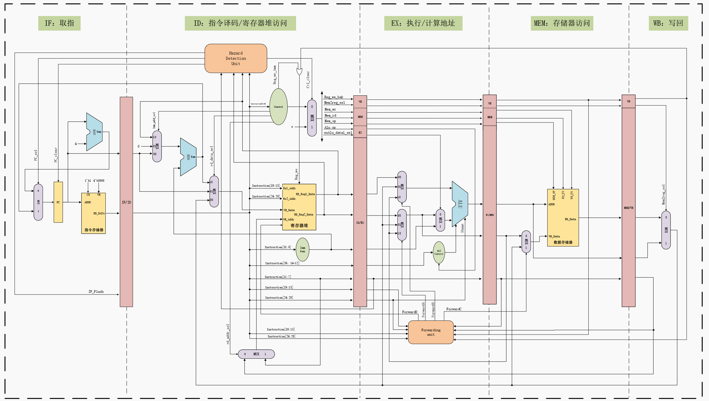

# CK-Riscv

# 介绍

博  客：[点击跳转](https://blog.csdn.net/weixin_40377195?type=blog)；


#### 内核架构
标准的5级流水线RISCV CPU，模块的划分如下图的框图基本一致，结构清晰，代码可读性比较高；目前代码设计基本完成，进入到验证阶段，详细的文档后面陆续补充完整；该CPU按照《计算机组成与设计 硬件/软件接口 RISCV-V版》设计的，强烈推荐大家阅读这本书，结合我的代码和仿真一起学习；由于工作比较忙，时间有限更新缓慢，代码可能有低级错误的地方，还望大家见谅！

# 安装教程
## 1.获取
我个人喜欢在自己home目录下建立一个专门IC工程文件夹：ic_prjs；也推荐大家这么做，养成文件管理的好习惯，在自己觉得ok的目录下，git取下CK_RISCV的整个工程；
```bash
git clone https://gitee.com/Core_Kingdom/CK_Riscv.git
```
## 2.工程目录结构说明
```bash
CK_Riscv
├── bashrc.env  			//工程环境配置    
├── fpga					//FPGA原型验证综合目录
│   ├── constraint
│   │   └── pin.xdc
│   ├── libs
│   ├── script
│   │   └── create_prj.tcl
│   └── work
│       └── Makefile
├── LICENSE
├── module					//RTL 代码
│   ├── chip				//顶层代码放置目录
│   │   └── rtl_v00			//代码版本
│   └── riscv_core			//RISCV Core 代码放置目录
│       └── rtl_v00			//代码版本
├── pic
│   ├── Architecture.png
│   └── image.png
├── README.en.md
├── README.md
├── scripts					//脚本命令
│   ├── open_dve			//打开DVE
│   ├── open_verdi			//打开VERDI
│   ├── regress				//Regress验证脚本
│   ├── rerun				//验证快捷命令
│   └── rvgccCom			//RISCV编译命令
└── verification				//验证目录
    ├── cases					//测试用例目录
    │   └── riscv_core			//验证的模块名
    ├── regress_fun				//Regress回归目录
    │   ├── config				//仿真配置
    │   └── Makefile			//case list Makefile 
    └── testbench				//仿真所需额外文件
        ├── environment.sv		//仿真环境文件
        ├── ext_behavior_model	//放置仿真行为级模型
        ├── ext_behavior_task	//常用tasks
        ├── instance			//tbtop例化
        └── tbtop.v				//tbtop
```
## 3.RISCV工具链
这里有三种方式：
- 其一，自己编译1套，这里可以参考：[大家一起从零设计RISC-V处理器（三）之Centos7 搭建RISC-V 32位交叉编译环境（ riscv-gnu-toolchain）](https://blog.csdn.net/weixin_40377195/article/details/123007323?spm=1001.2014.3001.5501)
- 其二，使用我编译好的，百度网盘下载：
```clike
链接：https://pan.baidu.com/s/1HsA1p7OCVdblqz71HzO-mw 
提取码：irl3 
--来自百度网盘超级会员V5的分享
```
由于文件比较大，虚拟机简易通过共享文件的方式拷入；

打开个人shell文件，在文件底部加入以下配置信息，退出后记得source；我这里是用户home目录下的`.bashrc`：
```bash
#=============================================================================================
#   RISCV Tools
#=============================================================================================
export RISCV=/home/Riscv_Tools
PATH=$PATH:$RISCV/bin
alias rv32_elf='riscv32-unknown-elf-gcc';
```
个人是放置在`/home`下，注意非个人home别搞混了。如果你放置在其他地方，需要修改上面`export RISCV=/home/Riscv_Tools`的路径；
使用下面命令进行解压得到`Riscv_Tools`：
```bash
tar -xf CK_Riscv_Tools.tar
```

- 其三，直接下载我分享的虚拟机，已安装IC_EDA工具、Riscv编译环境：[开源IC_EDA虚拟机](https://blog.csdn.net/weixin_40377195/category_11831057.html)

## 4.跑起来
一定要先source环境才能用；
```bash
source bashrc.env
```


进入到regress目录，有一个Makefile文件，里面全是RISCV的测试用例

跑所有的测试用例，当然可以单独跑一个，make单独的case名就行；
```bash
make rv	
```
每个case，自动编译C程序或者汇编程序，并自动吃入RAM中，仿真结束后也会打印测试用例的仿真结果；


regress结束后，生成以下文件，这个是每个测试用例的仿真目录；


进入其中仿真目录，使用`open_verdi`即可启动verdi查看仿真波形以及Debug；
从下图可以看出，main.c、main.s是我们测试激励（这里先编写汇编进行简单的验证），环境自动编译生成.verilog
文件，也就是仿真时吃入到ram中的二进制程序；.dump就是反汇编文件，帮助我们分析以及debug；
```bash
open_verdi
```


## 5.结果统计
输入一下命令统计Regress结果；
```bash
gen_simRpt
```


## 6.覆盖率检查
进入到config目录下，gvim打开sim_config，如图将覆盖率开关置为1；

回到regress目录，重新跑仿真，会生成覆盖率的目录，进入到该目录；

```bash
make rv
```

先合并多个case的覆盖率；
```bash
gen_cov
```


启动verdi查看覆盖率；
```bash
open_cov
```

## 7.原型环境移植（FPGA）
进入到FPGA移植目录下，以此为约束文件目录、库文件目录、FPGA RTL代码目录、自动化脚本目录、vivado综合工作目录；


工程的目标FPGA板卡：Xilinx A100T，目前该板卡仍然在售；板卡介绍和使用可见：
[开源RISC-V处理器(蜂鸟E203)学习（五）A100T-FPGA 移植蜂鸟Hbirdv2，实现Centos下调试器USB识别以及程序编译烧写，并进行C语言仿真](https://blog.csdn.net/weixin_40377195/article/details/125345914?spm=1001.2014.3001.5501)


每个人的电脑配置和给虚拟机CPU分配不一样，这个脚本需要根据自己实际情况修改一下；


进入到`work`目录下，使用以下命令进行FPGA自动化综合；
```bash
make built
```

出现以下信息，综合成功；

可以启动vivado GUI，会自动加载综合的工程；
```bash
make open
```


## 8.Spyglass Lint

```bash
make run_lint
```

出现以下信息，说明检查完成；

启动Spyglass GUI分析检查出的问题；
```bash
make open
```

## 9.DC综合
待完善。。。。
## 待续 更新中。。。。
--------------------------
## 你可能需要的
[centos7 升级安装 vim8.2（gvim）](https://blog.csdn.net/weixin_40377195/article/details/124644887?spm=1001.2014.3001.5501)

[Vmware 虚拟机 释放文件删除后的磁盘，缩小虚拟机大小](https://blog.csdn.net/weixin_40377195/article/details/124546526?spm=1001.2014.3001.5501)

[搭建属于自己的数字IC EDA环境（番外）：S家EDA工具 license失效，TCP端口占用问题](https://blog.csdn.net/weixin_40377195/article/details/124526508?spm=1001.2014.3001.5501)

[蜂鸟E203学习-专栏](https://blog.csdn.net/weixin_40377195/category_10730490.html?spm=1001.2014.3001.5482)

[搭建IC_EDA环境-专栏](https://blog.csdn.net/weixin_40377195/category_10560344.html?spm=1001.2014.3001.5482)

[RISC-V设计-专栏](https://blog.csdn.net/weixin_40377195/category_11623861.html?spm=1001.2014.3001.5482) 


#### 特技

1.  使用 Readme\_XXX.md 来支持不同的语言，例如 Readme\_en.md, Readme\_zh.md
2.  Gitee 官方博客 [blog.gitee.com](https://blog.gitee.com)
3.  你可以 [https://gitee.com/explore](https://gitee.com/explore) 这个地址来了解 Gitee 上的优秀开源项目
4.  [GVP](https://gitee.com/gvp) 全称是 Gitee 最有价值开源项目，是综合评定出的优秀开源项目
5.  Gitee 官方提供的使用手册 [https://gitee.com/help](https://gitee.com/help)
6.  Gitee 封面人物是一档用来展示 Gitee 会员风采的栏目 [https://gitee.com/gitee-stars/](https://gitee.com/gitee-stars/)


# CK_RiscV_BE

1.  Back-end self-learning projects, DE, DV, SYN are acquired from the above project, so no changes directly integrated; 
2.  Starting from lec, I want to learn the back-end process and test my knowledge level. 
3.  If there is any infringement, please contact to delete it.
